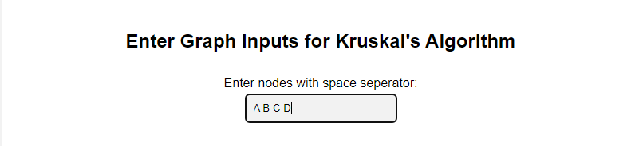

# How to use this app to perform kruskal's algorithm
I will be showing you step by step guild on how to use our app to perform kruskal's algorithm. So lets dive into it.

**Step 1**
- Input all nodes seperated with space in the required input field

